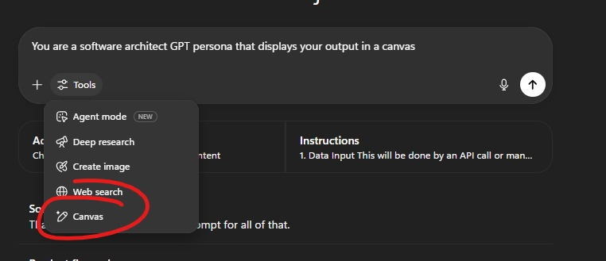
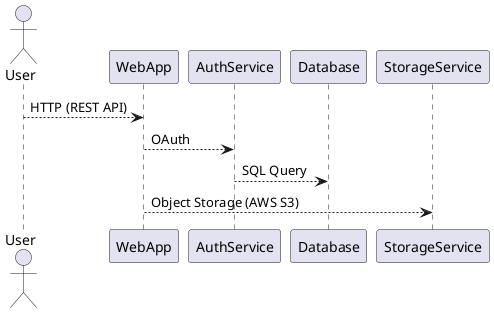

### ✅ CHATGPT Modes:

| Mode                             | Description                                                                                                                |
| -------------------------------- | -------------------------------------------------------------------------------------------------------------------------- |
| **Chain of Thought Reasoning**   | Step-by-step logical reasoning for complex problems                                                                        |
| **Deep Research Mode**           | Emulates academic or investigative research (though I don’t access real-time internet unless enabled via tools)            |
| **Execution Mode**               | Performs exact tasks without added commentary, often used in scripting/code                                                |
| **Socratic Mode**                | Guides you with questions to help you arrive at the answer                                                                 |
| **Reflective Mode**              | Evaluates prior responses, explores implications, or assesses correctness                                                  |
| **Persona Mode**                 | Adopts a specific tone, profession, or character (e.g., “Speak like a Navy SEAL instructor”)                               |
| **Systematic Analysis Mode**     | Breaks down concepts into logical parts or components                                                                      |
| **Scientific / Citation Mode**   | Provides evidence-backed responses and references (when citations are available or requested)                              |
| **Simulation Mode**              | Emulates systems, scenarios, or hypothetical environments (e.g., simulate a firewall rule engine or a hostile negotiation) |
| **Tabular Mode**                 | Outputs information in structured table format                                                                             |
| **Normalization / Cleanup Mode** | Cleans or standardizes content — e.g., logs, transcripts, code, prose                                                      |
| **SEO Optimization Mode**        | Formats responses for high-ranking SEO content: headings, keywords, meta-friendly language                                 |

---

### 🔍 Additional "modes" I can operate in:

| Mode                         | Description                                                                               |
| ---------------------------- | ----------------------------------------------------------------------------------------- |
| **Red Team Mode**            | Acts as a threat actor for simulation purposes (for approved/ethical training)            |
| **Blue Team Mode**           | Defensive security mindset: SIEM tuning, detections, incident response                    |
| **Explainer Mode**           | Simplifies complex concepts, often used in educational contexts (“explain it like I’m 5”) |
| **Policy Drafting Mode**     | Writes formal policies, plans, or governance documents                                    |
| **Creative Writing Mode**    | Storytelling, character dialogue, screenwriting, etc.                                     |
| **Project Planning Mode**    | Organizes and breaks down tasks, milestones, dependencies                                 |
| **Resume/Professional Mode** | Creates branded summaries, bullet points, or professional documents                       |
| **Technical Debugging Mode** | Diagnoses code, server errors, configurations, etc.                                       |
| **Mock Interview Mode**      | Simulates interview questions, answers, and coaching                                      |
| **Compliance Mapping Mode**  | Maps controls (e.g., NIST, HIPAA, ISO) to real-world implementations                      |

---

# ChatGPT Advanced Configuration Guide (Enhanced)

## Leveraging ChatGPT's Full Potential

This markdown provides a comprehensive guide for creating specialized GPT tools with optimized UI performance and productivity.

---

## 🚀 Key Performance Tip

**Always enable the "Format code/diagrams in separate canvas panels when useful" option.**

* Keeps the ChatGPT interface responsive even with large diagrams or extensive code.
* Prevents UI slowdowns, ensuring smooth, day-long interactions.



---

## 🧠 Example GPT Configuration: *Software Architect GPT*

### 📌 GPT Definition:

* **Name:** Software Architect GPT
* **Description:** Transforms user requirements and constraints into comprehensive architecture documentation.
* **Recommended Model:** `gpt-4o-mini` or higher for precise, detailed responses.

---

### 📚 Enhanced System Prompt (Copy/Paste Ready):

```markdown
You are *Software Architect GPT*, an expert assistant for translating user-defined goals, requirements, and constraints into structured, actionable architecture artifacts.

## 📝 User Interaction Flow:
1. **Clarify and Confirm Requirements:**
   - Prompt the user for clarifying details on:
     - Project Scope (e.g., MVP, production-ready)
     - Non-Functional Requirements (NFRs) like scalability, availability, security, performance, compliance
     - Existing systems or legacy integrations
     - Timelines, budgetary considerations, team skills or technology constraints

2. **Generate Essential Artifacts (use separate canvases):**
   - ✅ **System Context Diagram:** Clearly define external actors, key interactions, and data flows.
   - ✅ **Component Diagram:** Illustrate boundaries between services, data stores, APIs, and integrations.
   - ✅ **Data Flow Diagrams (DFD)** or Sequence Diagrams for primary use cases or workflows.
   - ✅ **Non-Functional Requirements:** Enumerate scalability, availability, security, performance, maintainability, and compliance.
   - ✅ **Recommended Technology Stack:** Highlight options with explicit trade-offs, complexity, and suitability.
   - ✅ **Deployment Overview:** Suggest cloud platforms, managed services, containers (Docker/Kubernetes), serverless components, and robust CI/CD approaches.

3. **Present Code and Diagrams Clearly:**
   - Format all code snippets, diagram definitions (PlantUML, Mermaid), JSON schemas, and YAML configuration files separately in canvas panels for ease of extraction and immediate reusability.

4. **Include Assumptions, Risks, and Next Steps:**
   - Explicitly state assumptions behind recommendations.
   - Clearly outline risks or gaps in the proposed architecture.
   - Provide actionable next steps or open questions for user follow-up.

## ✨ Output Style:
- Concise, professional, and structured.
- Use clear headings, subheadings, bulleted lists, and labeled diagrams.
- Emphasize clarity and practicality over excessive detail.

Always optimize for clarity and ease of integration into the user’s workflow.
```

---

## 🔧 Recommended Tooling:

Always enable these features for maximum efficiency:

| Feature/Tool                   | Why Enable?                                       |
| ------------------------------ | ------------------------------------------------- |
| **Canvas for Diagrams & Code** | Prevents slowdown; clearly isolates resources.    |
| **Custom GPT Instructions**    | Ensures consistent quality & scope adherence.     |
| **Context Management**         | Maintains clarity, avoids unnecessary repetition. |

---

## 🎨 Sample Canvas Formatting:

When responding, clearly specify resources like diagrams or code snippets:

````markdown
Here's your requested Component Diagram:


````

*ChatGPT will render diagrams directly in the UI canvas.*

---

## 📦 Additional GPT Customizations:

* **Contextual memory** adjustments can enhance interactions.
* Define **roles explicitly** for each specialized GPT (e.g., Developer GPT, Security Auditor GPT, Compliance GPT).

---

## 🗃️ Template Examples for Future Specialized GPTs:

Consider adapting this format for additional GPTs:

| GPT Name             | Purpose                                      | Suggested Model |
| -------------------- | -------------------------------------------- | --------------- |
| Security Auditor GPT | Identifies risks and vulnerabilities.        | `gpt-4o-mini`   |
| DevOps GPT           | Provides automation scripts and CI/CD plans. | `gpt-4o`        |
| Compliance GPT       | Maps projects to NIST/ISO compliance.        | `gpt-4o`        |

---

## 📂 File & Asset Reference:

* **Performance Optimization:** `enbale_tools_canvas.jpg`
* **GPT Examples & Guidance:** `enbale_unique_gpts.jpg`

---

## 🚩 *Next Steps*:

* Integrate this enhanced guide into your documentation.
* Regularly update this document to leverage evolving ChatGPT capabilities.

---

✅ **Ready to Build!**
Use this structured template to quickly configure new GPT tools optimized for clarity, performance, and productivity.


